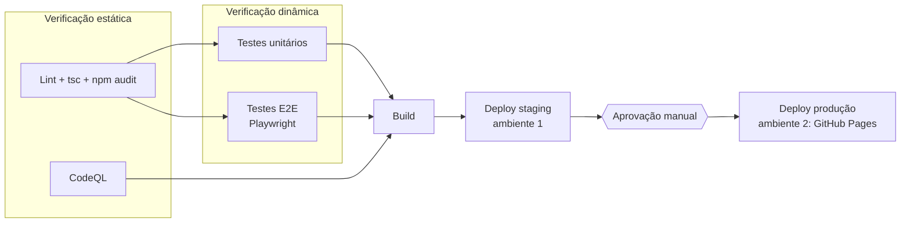

# Pipeline de CI/CD

O arquivo [`.github/workflows/ci-cd.yml`](../.github/workflows/ci-cd.yml) define o pipeline no GitHub Actions.

## Quando roda

| Evento                          | O que acontece                                                                                     |
| ------------------------------- | -------------------------------------------------------------------------------------------------- |
| Pull request para `main`        | Só as verificações: lint, tsc, npm audit, CodeQL, testes unitários, E2E e build. Nada é publicado. |
| Push em `main` (ou merge de PR) | Tudo acima, depois deploy em **staging** e, após aprovação, em **produção**.                       |
| Manual (`workflow_dispatch`)    | Igual ao push em `main`, útil para demonstrar em aula.                                             |

## Jobs e comandos

| Job                 | Tipo                          | Comandos                                                                                                           |
| ------------------- | ----------------------------- | ------------------------------------------------------------------------------------------------------------------ |
| `lint`              | Estática                      | `npm ci`, `npm run lint` (ESLint + Prettier), `npm run typecheck` (`tsc --noEmit`), `npm audit --audit-level=high` |
| `codeql`            | Estática (segurança)          | `github/codeql-action` para JavaScript/TypeScript                                                                  |
| `unit-tests`        | Dinâmica                      | `npm run test:coverage` (Vitest), salva a cobertura como artefato                                                  |
| `e2e-tests`         | Dinâmica                      | `npx playwright install --with-deps chromium`, `npm run e2e`                                                       |
| `build`             | Build                         | `npm run build`, salva `dist/` como artefato `site`                                                                |
| `deploy-staging`    | Deploy, ambiente `staging`    | Publica o artefato no Surge e faz um smoke test com `curl`                                                         |
| `deploy-production` | Deploy, ambiente `production` | `configure-pages`, `upload-pages-artifact`, `deploy-pages` e o mesmo smoke test no endereço publicado              |

O mesmo artefato do build é publicado nos dois ambientes, então o que foi testado em staging é exatamente o que vai para produção.

## Configuração única (feita no GitHub)

1. **GitHub Pages pelo Actions**: Settings → Pages → Build and deployment → Source: **GitHub Actions**. Enquanto o domínio `josecarloslee.online` não estiver apontando para o GitHub, deixe **Custom domain** vazio: o site fica em `https://jcal1998.github.io/lee-random/` (o build usa caminhos relativos, então funciona nos dois endereços). Quando o domínio voltar, preencha **Custom domain** com `josecarloslee.online` e marque **Enforce HTTPS**.
2. **Ambiente de produção com aprovação**: Settings → Environments → New environment → `production`. Marque **Required reviewers**, adicione você mesmo e, em _Deployment branches_, escolha **Selected branches** com `main`.
3. **Ambiente de staging**: Settings → Environments → New environment → `staging` (sem regras). O GitHub também cria esse ambiente sozinho no primeiro deploy.
4. **Staging público no Surge (opcional, recomendado)**:
   - No seu computador: `npx surge login` (cria a conta grátis) e depois `npx surge token`.
   - Settings → Secrets and variables → Actions → **New repository secret**: nome `SURGE_TOKEN`, valor = o token.
   - Opcional: variável `SURGE_DOMAIN` para escolher outro endereço (padrão `lee-random-staging.surge.sh`).

   Sem o `SURGE_TOKEN`, o job de staging não falha: ele serve o site dentro do próprio runner e roda o smoke test lá, mostrando um aviso no resumo da execução.

## Como demonstrar em aula

1. Abra um PR pequeno e mostre que só as verificações rodam.
2. Faça o merge e abra a aba **Actions**: o pipeline chega ao staging e para em _Waiting for review_.
3. Abra o link de staging, confira o site e clique em **Review deployments → Approve**.
4. O deploy de produção roda e o link do site aparece no resumo.
